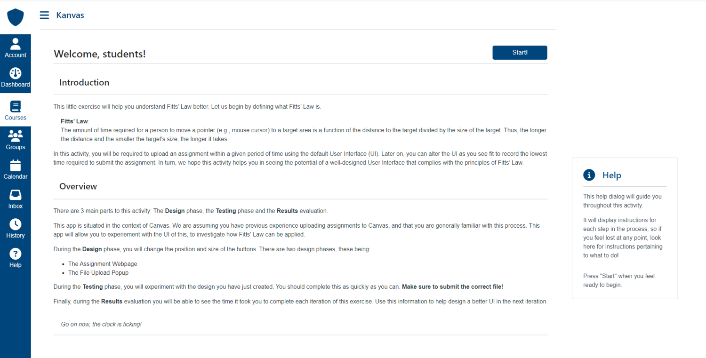
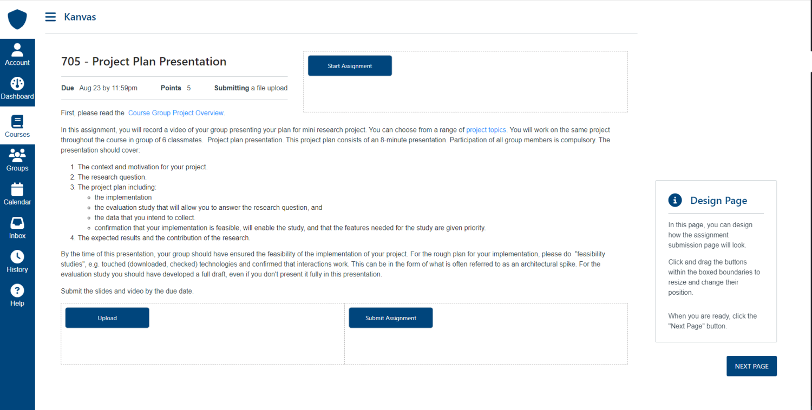
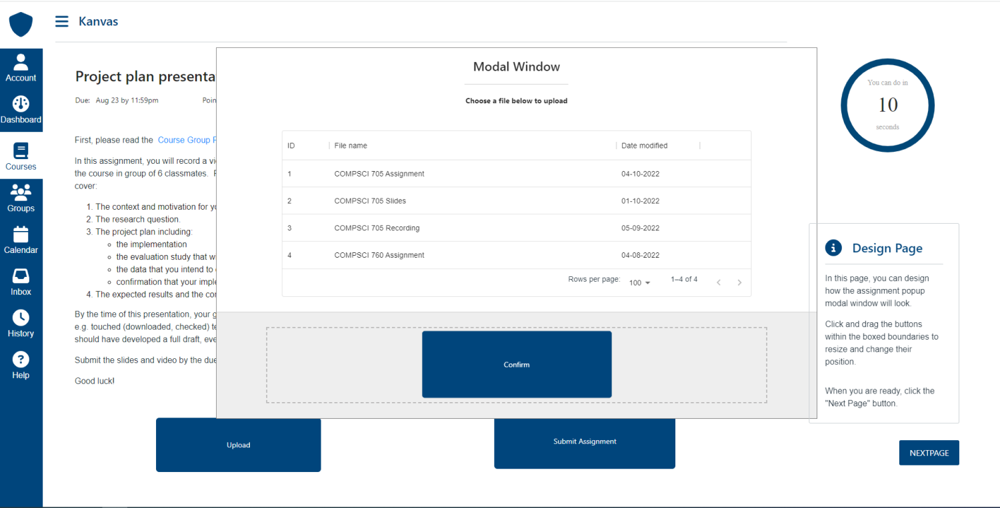
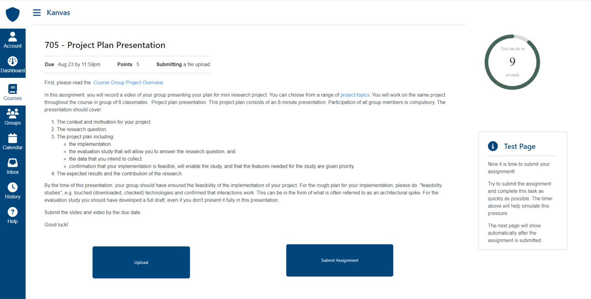
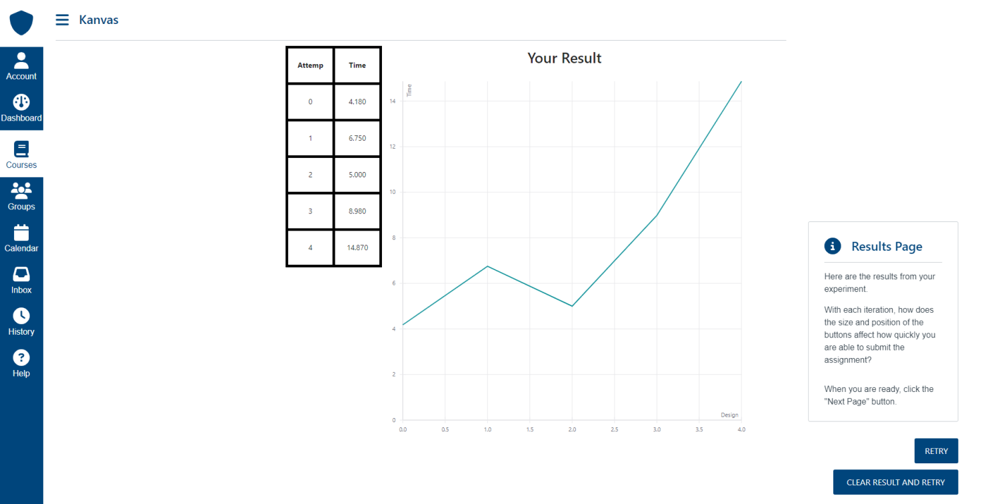

## Kanvas (Github repository link: https://github.com/yil409/705-project.git)

Our project is an assignment submission interface which also allows students to alter the button components present in the UI. There are 3 main parts to this activity: The Design phase, the Testing phase and the Results evaluation.

This app is situated in the context of Canvas. We are assuming that you have previous experience uploading assignments to Canvas and that you are generally familiar with this process. This app will allow you to experiment with the UI of this and to investigate how Fitts' Law can be applied.

During the Design phase, you will change the position and size of the buttons. There are two design phases:

- The Assignment Webpage
- The File Upload Popup

During the Testing phase, you will experiment with the design you have just created. You should complete this as quickly as you can. Make sure to submit the correct file!

Finally, during the Results evaluation, you will be able to see the time it took for you to complete each iteration of this exercise. Use this information to help design a better UI in the next iteration.

## Run this project on your local machine

To run this project, first you need to download the repo to your local machine and open it in your code editor.
Then run following commands in your terminal to install the dependencies and start the frontend:

```
cd frontend
npm install
npm start
```

Open [localhost:3000](https://localhost:3000) to view the project.

## Screenshot






